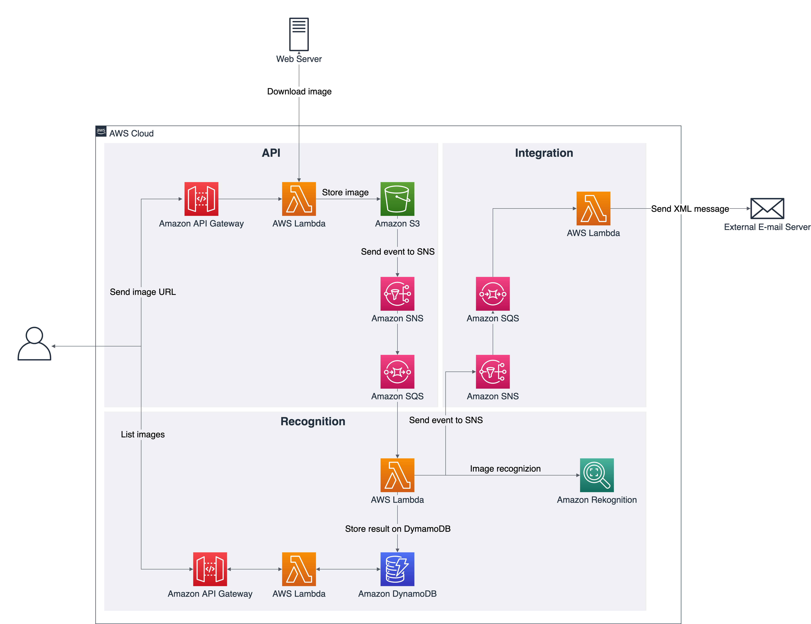

## Amazon CodeWhisperer Example

This repository accompanies a hands-on workshop that demonstrates how to leverage Amazon CodeWhisperer for building a fully fledged serverless app on AWS.

## Amazon CodeWhisperer

Amazon CodeWhisperer is a machine learning (ML)–powered service that helps improve developer productivity by generating code recommendations based on their comments in natural language and code in the integrated development environment (IDE).

With Amazon CodeWhisperer, developers can simply write a comment that outlines a specific task in plain English, such as “upload a file to S3.” Based on this, CodeWhisperer automatically determines which cloud services and public libraries are best suited for the specified task, builds the specific code on the fly, and recommends the generated code snippets directly in the IDE. Moreover, CodeWhisperer seamlessly integrates with your Visual Studio Code and JetBrains IDEs, in such a way that you can stay focused and never leave the development environment. See the [Amazon CodeWhisperer](https://aws.amazon.com/codewhisperer/) page for details.

## Try out Amazon CodeWhisperer

You can use this code repository to try out Amazon CodeWhisperer by building a full-fledged, event-driven, serverless application. With the aid of Amazon CodeWhisperer, you'll write your own code that runs on top of AWS Lambda to interact with Amazon DynamoDB, Amazon SNS, Amazon SQS, Amazon S3, and third-party HTTP APIs to perform image recognition using Amazon Rekognition. The users can interact with the application by sending the URL of an image for processing, or by listing the images and the objects present on each image.

### Architecture

### Prerequisites

To use the CodeWhisperer with this repo, you will need an AWS account and an active Amazon CodeWhisperer activation.

### Setup

Use the workshop description and follow the steps for building and deploying the application.

## Getting Help

Use the community resources below for getting help with AWS CodeGuru Reviewer.

- Use GitHub issues to report bugs and request features.
- Open a support ticket with [AWS Support](https://docs.aws.amazon.com/awssupport/latest/user/getting-started.html).
- For contributing guidelines, refer to [CONTRIBUTING](CONTRIBUTING.md).

## Contributing

See [CONTRIBUTING](CONTRIBUTING.md#security-issue-notifications) for more information.

## License

This project is licensed under the MIT-0 License. See the [LICENSE](LICENSE) file.

## update

